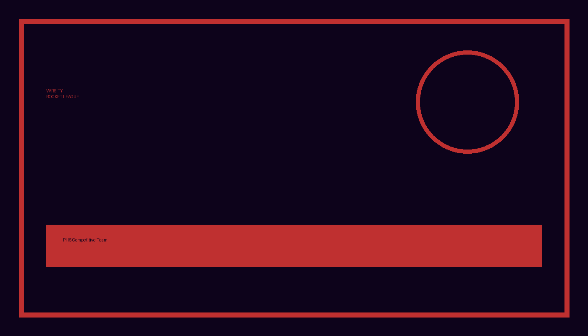
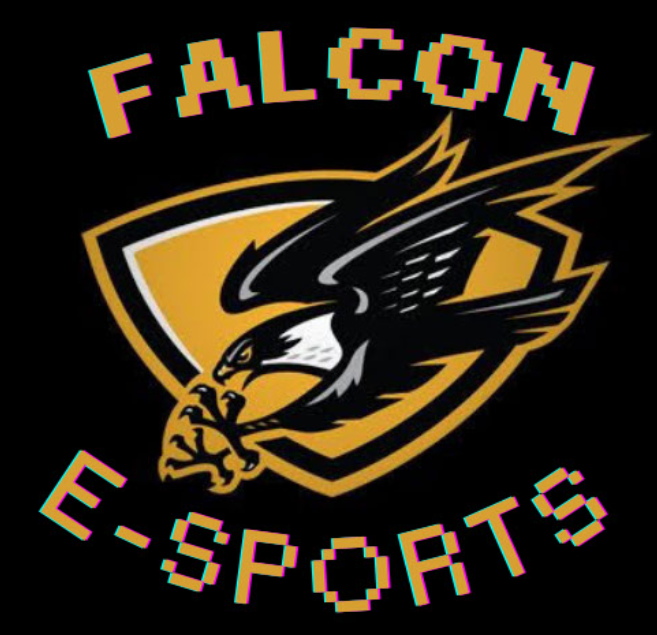
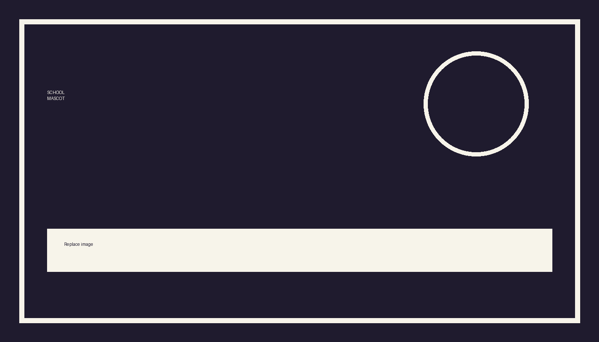

# Admin Notes for PHS Esports Website

This file is separate from the public website pages so visitors cannot see editing instructions.

## Demo Admin Login

Password: `captain2026`

The current login is a front-end demo. It checks the password in `js/main.js`, stores admin mode in browser `localStorage`, and shows a success pop-up. This is not secure because anyone can inspect front-end code.

For real private admin editing, use:
- Netlify CMS / Decap CMS
- Firebase Authentication + Firestore
- Supabase Auth + Database
- A school-approved backend

## How to Adjust Text

1. Open the page you want to edit, such as `index.html`, `about.html`, or `competitive.html`.
2. Find text inside tags like:
   - `<h1>...</h1>`
   - `<h2>...</h2>`
   - `<p>...</p>`
3. Replace only the words inside the tags.
4. Save and refresh the browser.

Example:
```html
<p>The club welcomes students who want to compete...</p>
```

## How to Adjust Images

1. Put the new image inside the `/assets` folder.
2. Use simple file names with no spaces, such as:
   - `falcon-logo.png`
   - `rocket-league-team.jpg`
   - `club-meeting.png`
3. In the HTML file, update the `src` value.

Example:
```html

```

Replace with:
```html

```

Always update the `alt` text so screen readers know what the image shows.

## How to Replace the Falcon Logo

The About Us page currently uses:
```html

```

Replace `assets/falcon-logo.png` with the official falcon logo file, or keep the same file name and overwrite the placeholder image.

## How to Add Highlights and Clips

Open `highlights.html`.

Copy this block:
```html
<article class="card video-card">
  <h2>Featured Clip</h2>
  <iframe loading="lazy" src="https://www.youtube.com/embed/dQw4w9WgXcQ" title="Placeholder esports highlight" allowfullscreen></iframe>
  <p>Replace this placeholder embed link with the team clip URL.</p>
</article>
```

Paste it inside:
```html
<section class="section video-grid">
```

Then replace:
- The `<h2>` title
- The `iframe src`
- The description paragraph

For YouTube, use the embed URL format:
```text
https://www.youtube.com/embed/VIDEO_ID
```

## How to Update Upcoming Games

Open `competitive-schedule.html`.

Each game looks like this:
```html
<article class="event-card">
  <div>
    <h3>September 12, 2026 at 4:00 PM</h3>
    <p>PHS vs. West Prep</p>
  </div>
  <div class="match-logos">
    
    
  </div>
</article>
```

Update:
- Date and time
- Opponent name
- Opponent mascot image path
- Opponent mascot alt text

## How to Update Completed Games

When a game is finished, move or copy it into the `Completed Games` section and add a score.

Example:
```html
<article class="event-card">
  <div>
    <h3>September 12, 2026</h3>
    <p>PHS defeated West Prep, 3-1.</p>
  </div>
</article>
```

## How to Update Upcoming Meetings

Open `casual-schedule.html`.

Change the meeting date, time, and game inside the Upcoming Meetings section.

## How to Update Completed Meetings

When a meeting is finished, add a short recap under Completed Meetings.

Example:
```html
<article class="event-card">
  <div>
    <h3>September 4, 2026</h3>
    <p>Students introduced themselves and voted on future game options.</p>
  </div>
</article>
```

## How to Update Calendar Events

Open `js/main.js`.

Find:
```js
const eventData = {
```

Add or edit dates using this format:
```js
"2026-09-12": "PHS vs. West Prep"
```

The format must be:
```text
YYYY-MM-DD
```

The calendar already supports September 2026 through June 2027.

## How to Change the Color Scheme

Open `css/styles.css`.

Competitive section:
```css
--competitive-accent: #bf3030;
```

Casual section:
```css
--casual-accent: #4057a3;
```

## How to Edit the Embedded Google Form

The embedded form appears in:
- `competitive-signup.html`
- `casual-signup.html`

Current link:
```text
https://docs.google.com/forms/d/e/1FAIpQLSc0jjVdnKvH2-rG9U5RFWdStTonzbW7cramWzIyfkWg0aglSw/viewform
```

To use a different form, replace the `src` in the iframe.

## Important Notes

- Do not edit `sitemap.xml` unless page names change.
- Do not delete `css/styles.css` or `js/main.js`.
- Keep image files inside `/assets`.
- Test every page after editing.


## Version 1.2 Notes
- New announcement badge is controlled by `latestAnnouncementIso` in `js/main.js`. It lasts 24 hours.
- Games and meetings are now stored in `eventData` in `js/main.js`. The calendar and upcoming/completed lists both use this same data.
- The calendar loops from June to September and September to June.
- Completed games automatically become dropdowns and include score/recap fields plus logo slots.
- Sign-up form titles now say `Sign-Up Form`, and iframe styling was adjusted to prevent the page from zooming out.
